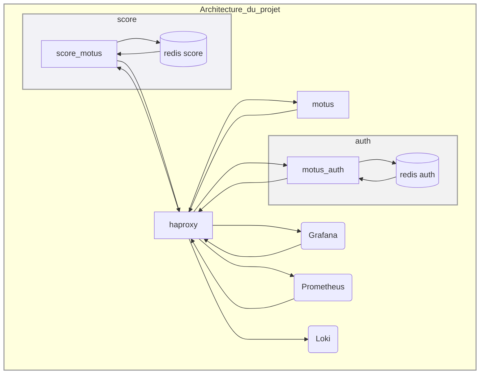
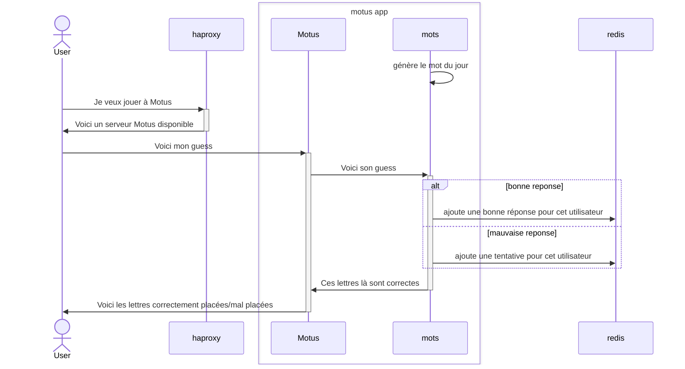
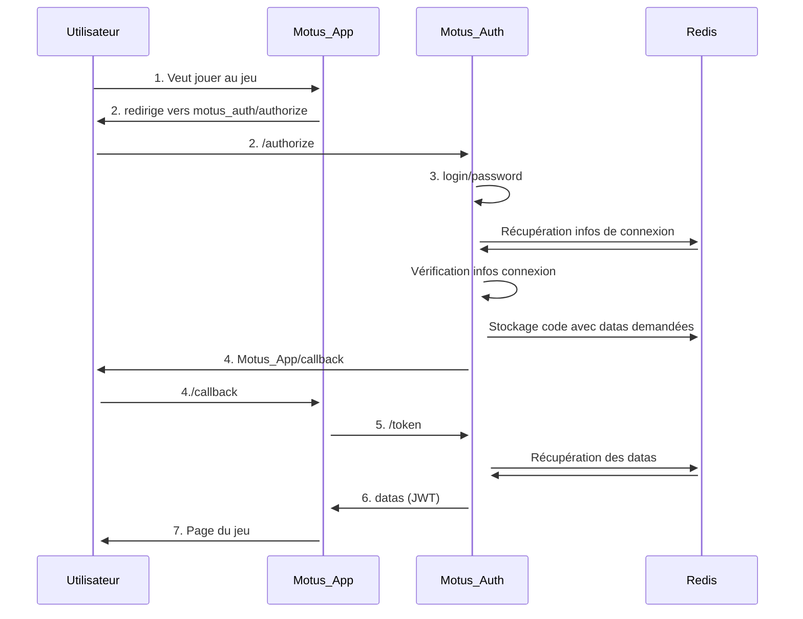
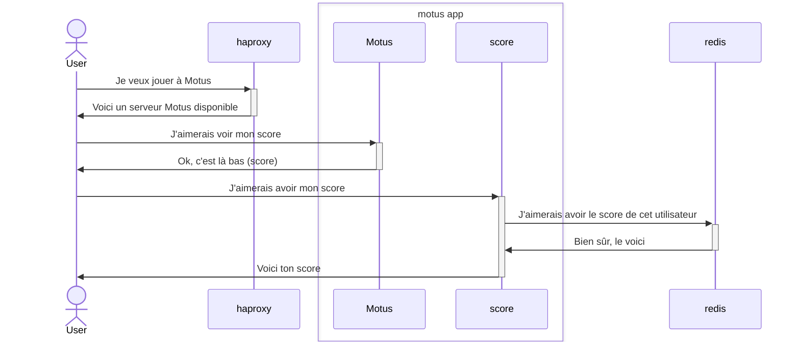

## Motus
Projet réalisé par :
- Florian Castanet : castanet.flr@gmail.com
- Thomas Laborde : labordetho@cy-tech.fr
- Quentin Dubois : quentin.dubois@cy-tech.fr

## Fonctionnalités:

- Le score a été implémenté.
- Le jeu est fonctionnel (les lettres sont coloriés (également en fonction du nombre de lettres dans le mot)).
- Le mot change chaque jour, et est persistant entre les rédemarrages.
- L'oauth2 est complètement fonctionnel (le nounce, et les access et refresh tokens ne sont pas implémentés)
- Toute l'application est régie avec haproxy pour la gestion du loadbalancing et de la redondance (sauf la partie monitoring)
- Chaque sous-partie (score, auth, et motus) sont indépendantes (explication de l'architecture plus bas)
- Il y a deux serveurs redis différents, un pour l'authentification et un pour le score
- Le système de log avec loki et prometheus couplés avec Grafana est fonctionnel (http://haproxy:3010/metrics)

## Pour lancer l'application:

1. Se rendre dans chaque dossier et faire (pour installer toutes les dépendances de chaque service):

````sh
npm install
````

2. Lancer l'application via docker:

```sh
sudo docker-compose up
```

## Pour tester les différentes redondances et indépendances:

```sh
sudo docker ps
sudo docker stop <id>
```

## Pour ajouter ou supprimer des instances:

Exemple avec l'ajout d'une instance du service d'authentification:

```yaml
  auth2:
    depends_on:
      - redis_auth
    build:
      context: ./motus-auth/.
      dockerfile: Dockerfile
    container_name: "auth2"
    ports:
      - "3012:3012"
    volumes:
      - motus_auth2:/data
    environment:
      - LOKI=http://loki:3100
      - PORT=3012
```

Il faut changer le routing des ports dans la section port et changer le PORT= dans environment pour éviter d'utiliser des ports déjà utiliés.

Ensuite il faut ajouter le nouveau serveur dans le haproxy.cfg comme ceci:

```cfg
backend auth
    cookie SERVER insert indirect nocache
    server auth1 auth1:3011 weight 50 check cookie auth1
    server auth2 auth2:3012 weight 50 check cookie auth2
```

Ensuite redémarrer l'application comme ceci:

```
sudo docker-compose up --build
```

## Architecture:


Diagramme de structure du projet :





Diagramme de séquence du fonctionnement du jeu Motus : 





Diagramme de séquence du fonctionnement du microservice "Auth" :





Diagramme de séquence du microservice "Score" :





Pour la suite tout est connecté au même haproxy pour la gestion des loadbalancing et des redondances de chaque microservice

- 2 instances de Motus
- 2 instances de Motus Score
- 2 instances de Motus Auth

Aucune instance n'est connectée directement à un autre mais toutes les connexions passent par le haproxy pour s'assure du loadbalancing et de la redondance des microservices.

Pour accéder à chaque service:

- http://localhost:3101 => Pour accéder à l'application
- http://localhost:3000 => Pour accéder à Grafana

## A améliorer:

- Ajouter des logs dans tous les microservices & dans metrics spécialisées (ici uniquement le nombre de connexion avec succès)
- Mettre toutes les variables de configuration (urls etc...) dans des variables d'environnements
